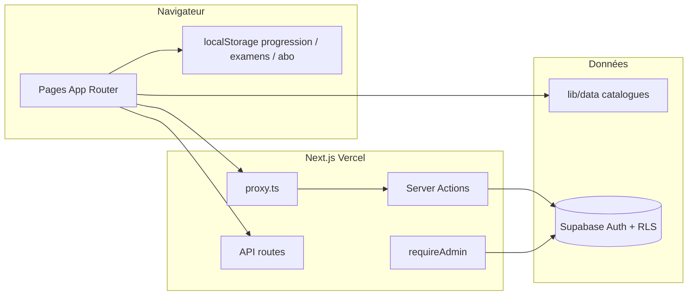

# Audit projet — Apple MDM Academy

**Date :** 16 août 2026  
**Branche de référence :** `main` @ `a869c15`  
**Périmètre :** architecture, sécurité, produit V1, contenu, qualité, ops  
**Méthode :** revue statique du dépôt (code, schémas SQL, routes, tests, PRs GitHub). Les scores admin existants (`getProjectScores`) ne sont **pas** repris tels quels : ils sont en partie hardcodés.

---

## 1. Verdict

La plateforme est un **LMS Next.js ambitieux et déjà très large** (parcours Apple / Jamf / Intune, quiz, examens, labs, dashboard, admin). Elle est **crédible comme preview / formation gratuite**, pas encore comme **produit certifiant ou SaaS payant**.

| Dimension | Note | Commentaire |
|-----------|------|-------------|
| Architecture applicative | 7/10 | App Router cohérent, auth SSR, périmètre V1 filtré |
| Complétude produit V1 | 6/10 | Catalogue riche ; médias, paiements et sync progression incomplets |
| Sécurité | 4/10 | Plusieurs failles réelles avant mise en production payante |
| Contenu pédagogique | 6/10 | Volume élevé ; banques d’examens et captures encore partielles |
| Qualité / tests / CI | 2/10 | ~78 kLOC TS, 4 fichiers de tests, **aucun** workflow GitHub Actions |
| Ops / production | 4/10 | Vercel + headers de base ; Stripe / emails / assistant stub |
| Marque / légal | 5/10 | Disclaimers présents ; logos et assets « officiels » à risque |
| **Global production** | **5/10** | OK preview ; bloquant pour certificats « officiels » et billing |

**Recommandation :** geler les nouvelles surfaces (admin, studio visuel, API v1) et traiter d’abord la sécurité, le schéma Supabase unique, le scoring serveur des examens, puis les médias et les banques QCM.

---

## 2. Identité du projet

| | |
|---|---|
| Produit | Formation FR indépendante Apple MDM, Jamf Pro, Microsoft Intune |
| Repo | [khafpro2/apple-mdm-academy-refonte](https://github.com/khafpro2/apple-mdm-academy-refonte) |
| Prod | https://apple-mdm-academy-refonte.vercel.app |
| Stack | Next.js 16 App Router, React 19, Tailwind 4, TypeScript, Supabase Auth, Vercel |
| Volume | ~567 fichiers TS/TSX, ~78 650 lignes, 82 `page.tsx`, **675** routes générées au build (quasi toutes dynamiques), 15 API, 23 pages admin, 139 composants |

Périmètre V1 déclaré : Apple / Jamf / Intune uniquement. Les MDM hors scope (Kandji, Mosyle, Addigy, Workspace ONE) sont bloqués en 404 réelle via `proxy.ts` + `lib/v1/block-removed-paths.ts`. C’est une bonne discipline produit.

---

## 3. Architecture

### Points solides

- **App Router** avec layouts, loading/error, metadata SEO, sitemap/robots.
- **Auth** : `@supabase/ssr`, cookies HTTP-only, Server Actions (`app/actions/auth.ts`), callback `/auth/callback`, politique mot de passe côté UX.
- **Proxy Next 16** (`proxy.ts`) : refresh session + blocage des slugs hors V1.
- **Admin** : `requireAdmin()` dans `app/admin/layout.tsx` (gate réelle, pas seulement UI).
- **Contenu versionné en code** (pas de CMS) : reproductible, auditable, adapté à un catalogue pédagogique.

### Points faibles

1. **Double arborescence `lib/` et `src/lib/`**  
   Vidéos, ressources, storyboards vivent sous `src/lib/` ; le reste sous `lib/`. Coût de navigation et risque de duplications.

2. **Deux moteurs d’examens**  
   `lib/exam/*` (catalogue, session localStorage, audit) et `lib/exams/*` (formats officiels, scoring, sélection). Ils s’appellent l’un l’autre. Fragile à maintenir.

3. **Surface trop large vs cœur LMS**  
   23 pages `/admin/*`, studio visuel, pipeline HeyGen, API OpenAPI, dashboard enterprise démo, assistant IA. Beaucoup de **scaffolding** autour d’un cœur encore incomplet (vidéos, Stripe, scoring serveur).

4. **Schéma SQL fragmenté**  
   `schema.sql` → `schema-admin.sql` → `schema-phase2.sql` → `migrations/20260611_contact_achievements.sql`. Pas de runner de migrations (ni CLI Supabase). Drift inévitable entre environnements.

5. **Mode gratuit forcé**  
   `FREE_PLATFORM_MODE = true` dans `lib/pricing/platform-access.ts`. `getEffectiveTier()` retourne **toujours** `"enterprise"` (même hors mode gratuit). Le paywall est du code mort, pas un produit.

---

## 4. Inventaire produit (état réel)

| Zone | Volume observé | État |
|------|----------------|------|
| Parcours (`tracks`) | 14 visibles | Apple 1–5, Jamf 100/170/200/300/400, Intune, Azure |
| Cours | 18 slugs racine | Structure complète ; qualité inégale (templates vs leçons custom) |
| Labs | **75** exportés (`lib/labs` + expert/ACITP) | Score interne labs 98/100 — heuristique généreuse (scénarios souvent générés) |
| Quiz | **74** type quiz | Scoring client uniquement |
| Examens | **12** type `examen` | Formats tracés ; **banques sous-dimensionnées** (voir §7) |
| Leçons | **197** | Seulement **55** au statut `complet` (audit pédagogique) |
| Scripts / fiches vidéo | ~76 items audit | Catalogue + mode préparation ; **aucun MP4** dans `public/videos/` |
| HeyGen | `heygenVideoResults = {}` | Pipeline vide |
| Ressources | **110** (audit LMS) | Checklists + guides prod ; score interne 100 |
| Captures | 122 référencées | **24 manquantes** |
| Dashboard | Oui | Fallback localStorage si schéma incomplet |
| Certificats PDF | Oui | Générés côté serveur **à partir du score client** |
| Tarifs / Stripe | UI présente | Checkout = stub ; mode gratuit |
| Assistant | `/assistant` + `/api/assistant/chat` | Route existante **sans clé API** |
| i18n | `/` FR + `/en` | Landing seulement ; le reste est FR |

Les audits internes (`/admin/final-audit`, pédagogique, LMS, screenshots) existent et sont utiles. En revanche `getProjectScores()` ajoute des constantes (`technique: 95`, `ux: 90`…) indépendantes des checks : **ne pas les citer comme KPI**.

Mesures runtime du 16/08/2026 :

| Audit | Score global | Lecture critique |
|-------|--------------|------------------|
| Pédagogique `runPedagogicalAudit()` | 89 | Leçons 88 alors que 55/197 seulement sont `complet` — le barème est trop indulgent |
| LMS `runLmsAudit()` | 91 | 6 modules complets, 3 partiels, 1 incomplet (`platform-sso-mfa`, `examen-intune-mac` manquants) |
| Vidéos (sous-score pédago) | 66 | Aligné avec l’absence de MP4 |
| Captures | 80 | 24 chemins manquants / 122 |

---

## 5. Sécurité (priorité haute)

Classement : **P0** = exploitable maintenant si l’app est publique ; **P1** = à corriger avant billing / certificats ; **P2** = durcissement.

### P0 — Endpoints et secrets

| ID | Finding | Détail |
|----|---------|--------|
| S1 | **Provision démo non authentifiée + service role** | `POST /api/auth/demo/provision` crée/reset le user démo et reseede la base dès que `SUPABASE_SERVICE_ROLE_KEY` est défini. Pas d’auth, pas de secret partagé. |
| S2 | **Mot de passe démo dans le dépôt** | `DEMO_USER_PASSWORD = "Demo123!"` dans `lib/demo/constants.ts`. Connu de quiconque clone le repo. |
| S3 | **Session démo sans compte** | `POST /api/auth/demo/session` pose un cookie `ama_demo_session=1` et ouvre `/dashboard`. Acceptable en preview ; dangereux si le dashboard expose des données réelles. |
| S4 | **Webhook Supabase ouvert si secret absent** | `verifySecret` : `if (!WEBHOOK_SECRET) return true`. N’importe qui peut POST `/api/webhooks/supabase` et déclencher des emails. |
| S5 | **Assistant Anthropic sans authentification ni clé** | `POST /api/assistant/chat` n’envoie pas `x-api-key` / `ANTHROPIC_API_KEY`. Soit l’appel échoue toujours, soit une clé d’environnement implicite n’est pas dans ce repo. Rate-limit **in-memory** (inefficace sur Vercel serverless). Pas de gate utilisateur. |
| S6 | **`blockDemoWrite()` n’est jamais appelé** | Le garde-fou lecture seule du compte démo n’est branché nulle part. Un login démo peut écrire progression / quiz. |

### P1 — Intégrité des examens et certificats

| ID | Finding | Détail |
|----|---------|--------|
| S7 | **Scoring 100 % client** | `QuizEngine` / `ExamEngine` calculent `score` / `passed` et les envoient à `saveQuizResult` → `insertQuizResult` **sans re-vérification**. Un utilisateur authentifié peut insérer 100 % et obtenir un PDF. |
| S8 | **Réponses dans le bundle JS** | Les QCM (y compris `correctIndex`) sont dans `lib/data/quizzes.ts` importé par des Client Components. Les examens « blancs » ne sont pas des examens. |
| S9 | **Vérification publique de certificat cassée** | `/api/certificates/verify/[id]` lit `quiz_results` avec le client utilisateur. RLS = « own rows only ». Un tiers non connecté (ou un autre user) reçoit 404. La page `/certificat/verify` ne peut pas fonctionner comme preuve publique. |
| S10 | **Webhook Stripe inopérant et dangereux** | Signature HMAC comparée en `===` (pas timing-safe). Client cookie (pas service role). Colonnes `tier` / `stripe_customer_id` **absentes** des schémas SQL. Checkout répond « Implémenter stripe.checkout.sessions.create() ici ». |

### P1 — AuthZ admin et données

| ID | Finding | Détail |
|----|---------|--------|
| S11 | **Admin via `ADMIN_EMAILS` env** | Si l’email match la liste Vercel, `checkIsAdmin` retourne true même hors `admin_allowlist`. OK si l’email est vraiment celui du compte ; double source de vérité (env + SQL) à documenter. |
| S12 | **Stats abonnements inventées** | `fetchAdminStats` : `proUsers = round(totalUsers * 0.12)`. Dashboard admin **menteur** sur le MRR. |
| S13 | **Vue `leaderboard_scores`** | Agrège `full_name` + scores. Selon les GRANTs Supabase, une vue `security definer` (défaut) peut **contourner RLS** des tables sous-jacentes. À vérifier en SQL Editor (`security_invoker`). |
| S14 | **Contact : succès silencieux** | Si Resend échoue, `saveToSupabase` est un no-op (`void payload`) mais l’API répond `ok: true`. Messages perdus. Policy `contact_requests` admin s’appuie sur `current_setting('app.admin_emails')` jamais initialisé. |
| S15 | **API v1 CORS `*`** | `/api/v1/users` expose un user démo. Catalogue public OK ; le endpoint `users` n’a rien à faire en ouvert. |

### P1 — Dépendances (`npm audit --omit=dev`)

`next@16.2.7` est dans la plage vulnérable **9.3.4-canary.0 – 16.3.0-preview.10** (4 advisory high, dont un **bypass Middleware / Proxy** App Router + Turbopack, DoS Server Actions, SSRF). `postcss`, `nanoid` et `sharp` (dev/image) sont aussi en high. Le projet utilise précisément `proxy.ts` + build Turbopack : **mettre à jour Next.js en priorité**.

### P2 — Headers et hygiène

- Headers présents : `X-Content-Type-Options`, `X-Frame-Options`, `Referrer-Policy`, `Permissions-Policy`.
- **Absents :** `Content-Security-Policy`, `Strict-Transport-Security` (HSTS souvent au edge Vercel, à confirmer).
- `X-XSS-Protection: 1; mode=block` est obsolète / contre-productif sur les navigateurs modernes.
- Rate-limits contact / assistant : Map processus, reset à chaque cold start, partageable entre users derrière le même `x-forwarded-for`.
- Exemple d’URL projet dans `lib/supabase/env-validation.ts` (`uqlhjtgcfbbhkcvjdybs.supabase.co`) : identifiant d’instance réel dans le code.
- Build : warning NFT « whole project traced » sur `app/admin/video-pipeline/production-packs` (fs dynamique) — déjà partiellement mitigé par `outputFileTracingExcludes`.

---

## 6. Données & progression

### Ce qui est bien

- RLS activé sur profiles, progress, quiz_results, badges, lesson_progress, study_sessions.
- Trigger `handle_new_user` + `ensureUserProfile` côté app (les commits récents `#9` / `#11` ont durci l’inscription).
- `is_admin()` + `admin_allowlist` en SQL `security definer` avec `search_path` vide.

### Trous

- Progression **double-écrite** : Supabase **et** localStorage (`lib/lesson/progress-storage.ts`, `lib/exam/*-storage.ts`, `lib/pricing/subscription-storage.ts`). En cas de schéma incomplet, l’app « marche » en local : OK pour démo, **mauvais pour un apprenant multi-device**.
- Pas de colonnes billing sur `profiles`.
- Migration `contact_requests` non branchée au code contact.
- Pas de tests d’intégration RLS.

---

## 7. Pédagogie, examens, médias

### Examens

`docs/exams/exam-bank-readiness.md` est honnête : banques inférieures aux cibles (ex. Apple Device Support 10/80, Intune Apple 35/60). Le moteur réduit la simulation et affiche un warning — bon comportement.

Incohérences de cibles :

- `examQuestionCounts["examen-jamf-100"] = 100` vs format officiel tracé **50 questions / 60 min / 80 %**.
- Certains quiz `examen-*` n’embarquent que `.slice(0, 5)` dans l’objet quiz ; le pool réel est ailleurs. Correct si l’UI utilise toujours `getExamPool`, risqué si un écran lit `quiz.questions`.

Les formats Jamf 200/300/400 et Intune « Apple » sont marqués `needs-review` / `internal`. Ne pas les vendre comme équivalent officiel.

### Médias

Audit existant `audit/media-usage-audit.md` (juin 2026) toujours pertinent :

- Pas de MP4 publiés.
- Captures générées / « originals » Apple-Jamf à risque IP.
- `public/logos/apple.svg` silhouette Apple — usage marque strictement encadré.

Les pages `/videos` basculent en mode préparation : conforme aux PROJECT_RULES (« ne pas bloquer le site si médias absents »).

### Marque

Placeholders logos Microsoft/Intune/Entra/Learn avec TODO explicites. Disclaimers non-affiliation en footer : à conserver. Ne pas présenter les certificats academy comme certifications Apple/Jamf/Microsoft.

---

## 8. Qualité, tests, process

| Contrôle | État |
|----------|------|
| `npm run lint` (`--max-warnings 0`) | **OK** le 16/08/2026 ; **pas de CI** pour l’appliquer |
| `npm run build` | **OK** (Next 16.2.7 Turbopack, 675 pages) ; warning NFT admin vidéo |
| Tests unitaires | 1 fichier : `tests/unit/auth-signup.test.ts` |
| E2E Playwright | 2 specs. `audit.spec.ts` hardcode l’URL **prod** au lieu de `baseURL` |
| GitHub Actions | **Aucun** dossier `.github/` |
| PRs ouvertes | 13+ (surtout DRAFT vidéo / auth / motion) — chantier parallèle non fusionné |
| Issues GitHub | Aucune — pas de backlog tracé |

`PROJECT_RULES.md` interdit de travailler sur `main` ; l’historique récent merge pourtant directement sur `main`. Divergence process Cursor vs Codex vs cloud agents.

E2E `audit.spec.ts` échoue volontairement si un bouton collapse sidebar existe (`Found N sidebar arrow button(s)`) : assertion figée, pas un test de régression fiable.

---

## 9. SEO, a11y, légal, ops

**SEO :** metadata, OG image, JSON-LD organisation, sitemap, robots (disallow `/admin`, `/api`, `/dashboard`). URL canonique par défaut encore `apple-mdm-academy-refonte.vercel.app` — à changer dès le domaine custom.

**A11y :** travail déjà documenté (`docs/UI-ACCESSIBILITY-AUDIT.md`) : skip-link, `lang=fr`, focus visible, cibles 44px. Contraste WCAG AA et lecteurs d’écran **non audités**.

**Légal :** `/privacy`, `/terms`, `/legal`, email `kthiam@harmytech.com`. Cookie notice + Vercel Analytics. Vérifier base légale (analytics vs consentement).

**Ops :** `vercel.json` minimal (X-Robots-Tag). `outputFileTracingExcludes` pour éviter un bundle admin > 300 MB (déjà vécu). Pas de monitoring réel (`/status` est placeholder). Pas de SDK Stripe (volontaire pour le bundle) mais alors le webhook maison doit être correct — il ne l’est pas.

---

## 10. Plan d’action priorisé

### Immédiat (sécurité preview)

1. **Upgrader Next.js** hors de la plage CVE (bypass proxy / DoS Server Actions).
2. Protéger `POST /api/auth/demo/provision` (secret, IP allowlist, ou script CLI uniquement — supprimer la route publique).
3. Exiger `SUPABASE_WEBHOOK_SECRET` (fail closed).
4. Auth + quota sur `/api/assistant/chat` ; envoyer la clé Anthropic **uniquement serveur** ; désactiver la route si clé absente (503).
5. Brancher `blockDemoWrite()` dans toutes les Server Actions d’écriture.
6. Retirer `users` de l’API v1 publique.

### Avant tout discours « certificat » / tarif payant

7. Recalculer score et `passed` **côté serveur** à partir des réponses + banque ; ne plus faire confiance au client.
8. Servir les examens sans `correctIndex` au client (API session + correction serveur).
9. Vérification certificat en **service role** + payload public minimal (nom, examen, date, hash) — pas toute la ligne `quiz_results`.
10. Unifier le schéma SQL (une chaîne de migrations) ; ajouter `tier` seulement quand Stripe est réel.
11. `FREE_PLATFORM_MODE` + `getEffectiveTier` : une seule source de vérité ; ne plus forcer enterprise.
12. Checkout Stripe réel **ou** retirer les routes stub du produit.

### Produit V1 (qualité)

13. CI : `lint` + `type-check` + `build` sur chaque PR.
14. Compléter les banques sous les cibles **ou** masquer les simulations « full length ».
15. Aligner Jamf 100 sur 50 Q / 60 min / 80 %.
16. Pipeline captures lab (données fictives) ; retirer ou reléguer les assets « official » Apple.
17. Fusionner ou fermer les PRs draft vidéo/auth pour réduire le WIP.
18. i18n : soit landing EN seulement (assumer FR-only), soit extraire les strings du shell.

### Ne pas faire maintenant

- Nouvelles pages admin / studio / API.
- Promesses commerciales Jamf 300/400 ou « certification officielle ».
- Dashboard enterprise au-delà de la démo.

---

## 11. Cartographie des fichiers d’audit déjà dans le repo

Ne pas dupliquer ces outils : les **utiliser**, mais ne pas croire leurs scores globaux.

| Outil | Rôle |
|-------|------|
| `/admin/final-audit` | Checklist env + volumes — scores globaux **biaisés** |
| `/admin/pedagogical-report` | Qualité leçons/labs (marqueurs placeholder) |
| `/admin/lms-audit` | Couverture modules vs slugs |
| `/admin/exam-audit` | Banques QCM |
| `/admin/content-audit` | Screenshots |
| `audit/media-usage-audit.md` | IP / logos |
| `docs/UI-ACCESSIBILITY-AUDIT.md` | A11y V1 |
| `docs/exams/*` | Formats officiels vs banques |
| `scripts/check-internal-links.mjs` | Liens internes |

Cet audit-ci couvre ce que les pages admin **ne** couvrent **pas** : authZ, webhooks, Stripe, scoring client, CI, dette structurelle.

---

## 12. Synthèse exécutive

Apple MDM Academy est une **refonte déjà utilisable pour parcourir un catalogue FR** Apple / Jamf / Intune, avec une vraie ossature LMS (auth, dashboard, quiz, exams UI, labs, admin).  

Elle n’est **pas** encore :

- un examen anti-triche ;
- un système de certificats vérifiables par un tiers ;
- un SaaS facturé ;
- une plateforme vidéo ;
- un process ingénierie avec CI et schéma unique.

Traiter S1–S8 et l’upgrade Next.js avant d’élargir l’audience au-delà d’un cercle de confiance. Ensuite : scoring serveur, banques QCM, médias lab, Stripe ou assumer durablement le gratuit.

---

## 13. Vérifications de cette revue

| Commande | Résultat (16/08/2026) |
|----------|------------------------|
| `npm run lint` | OK, 0 warning |
| `npm run build` | OK, Next.js 16.2.7 Turbopack, 675 pages |
| `npm audit --omit=dev` | 4 high (next, postcss, nanoid, sharp) |
| `runPedagogicalAudit()` | global 89 ; 55/197 leçons `complet` |
| `runLmsAudit()` | global 91 ; 1 module incomplet (PSSO / examen-intune-mac) |
